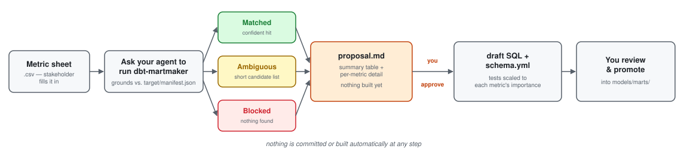

<div align="center">
  
</div>

<p align="center">
  Turns a metric requirements sheet into a draft dbt mart model
  (<code>dim_</code>/<code>fct_</code>/<code>rpt_</code>), grounded against
  your project's own <code>target/manifest.json</code>. An <b>agent
  skill</b> — instructions Claude Code (or any <code>AGENTS.md</code>-reading
  agent) follows directly. No package, no server, no CLI binary.
</p>

<p align="center">
  <a href="LICENSE"></a>
  <a href="https://github.com/AndyMDH/dbt-martmaker/releases/latest"></a>
  <a href="https://github.com/AndyMDH/dbt-martmaker/actions/workflows/ci.yml"></a>
  
</p>

<p align="center">
  
</p>

## Install

```bash
git clone https://github.com/AndyMDH/dbt-martmaker.git && ./dbt-martmaker/install.sh
```

Symlinks `skills/dbt-martmaker/` into `~/.claude/skills/` (`--project` for
one repo only, `--copy` instead of a symlink) — or skip the script and
copy that folder there yourself. Requires a dbt project with
`target/manifest.json` (`dbt parse`).

## Quickstart

`cd` into your dbt project and ask your agent:

> Set up a dbt-martmaker metric sheet for churn metrics, then run it.

That scaffolds `.dbt-martmaker/sheets/churn-metrics.csv` — one row per
metric, in the stakeholder's own words, not SQL. Two rows from the full
example ([`examples/churn-metrics.csv`](examples/churn-metrics.csv)):

| metric | reasoning | importance |
|---|---|---|
| Average payment amount | I quote this in pricing reviews so it has to be right — refunds have skewed it negative before | high |
| Monthly churned users | board asks about churn every quarter — we should see it in our login/activity data | high |

Each candidate table/column is then grounded against `target/manifest.json`
— **matched**, **ambiguous**, or **blocked**, never guessed — and a
proposal is written that **stops for your approval** before anything is
drafted. Same two metrics, from the proposal's summary table
([`examples/proposal.md`](examples/proposal.md)):

| metric | proposed calculation | importance | status |
|---|---|---|---|
| Average payment amount | `avg(amount)` in `stg_payments` | high | Matched |
| Monthly churned users | — (blocked, no source found) | high | Blocked |

Full walkthrough — all 5 example rows, the complete proposal, and the
drafted SQL/schema.yml once approved: [`docs/USAGE.md`](docs/USAGE.md).

## Scope

- **Mart layer only** — combines models that already exist in
  `models/staging/`/`models/intermediate/`; a metric needing a genuinely
  new raw source is flagged **blocked**, never attempted.
- **Reuses your conventions** — naming/materialization and existing
  generic tests (built-in, package, or custom) are detected from your
  project, not assumed.
- **Never runs dbt** — no `dbt build`/`run`/`test`; output is a proposal
  doc plus draft SQL/schema.yml for you to review and promote yourself.

## Documentation

| | |
|---|---|
| [`docs/USAGE.md`](docs/USAGE.md) | Full walkthrough — example sheet, proposal, drafted SQL/schema.yml, and the under-the-hood steps. |

## License

MIT — see [LICENSE](LICENSE).
