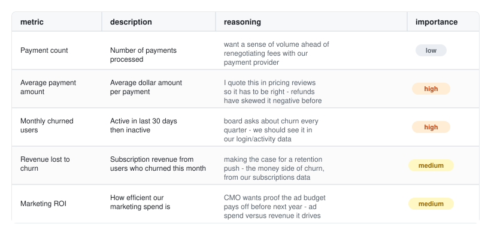
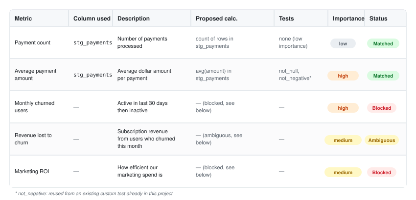

<div align="center">
  
</div>

<p align="center">
  dbt-martmaker turns a metric requirements sheet into a draft dbt mart
  model (<code>dim_</code>/<code>fct_</code>/<code>rpt_</code>). It grounds
  every match against your project's own <code>target/manifest.json</code>
  — it never guesses.
</p>

<p align="center">
  This is an agent skill: Claude Code (or any <code>AGENTS.md</code>-reading
  agent) follows these instructions directly, calling a few small Python
  scripts along the way. There is no package to install and no service to
  run.
</p>

<p align="center">
  <a href="LICENSE"></a>
  <a href="https://github.com/AndyMDH/dbt-martmaker/releases/latest"></a>
  <a href="https://github.com/AndyMDH/dbt-martmaker/actions/workflows/ci.yml"></a>
  
</p>

<p align="center">
  
</p>

## Why

Analytics teams get metric requests in Slack threads, emails, and hallway
conversations. Turning one into a real dbt model takes real work, even for
a simple metric. An engineer must find the right staging model, infer a
calculation from a vague description, and pick the right tests.

dbt-martmaker moves that first pass into a structured sheet. A stakeholder
fills it out alone, with no SQL required. The tool grounds every claim
against your actual project, and stops for your approval before it writes
a single file.

## Install

```
/plugin marketplace add AndyMDH/dbt-martmaker
/plugin install dbt-martmaker
```

This installs dbt-martmaker as a Claude Code plugin. It needs a dbt
project with a `target/manifest.json` file. If the project has none yet,
run `dbt parse` first.

Not sure the project has everything the skill needs? Run
`python scripts/doctor.py` first — see [Utilities](#utilities).

## Quickstart

`cd` into your dbt project and ask your agent:

> Set up a dbt-martmaker metric sheet for churn metrics, then run it.

That command creates `.dbt-martmaker/sheets/churn-metrics.csv`. Each row
holds one metric, described in the stakeholder's own words, not SQL
([full file](examples/churn-metrics.csv)):

<p align="center">
  
</p>

The tool grounds each candidate table and column against
`target/manifest.json`. Every result is **matched**, **ambiguous**, or
**blocked** — never guessed. It then writes a proposal and stops for your
approval before it drafts anything. This is the proposal's summary table
([full file](examples/proposal.md)):

<p align="center">
  
</p>

Full walkthrough — per-metric detail, drafted SQL/schema.yml once
approved, and the under-the-hood steps: [`docs/USAGE.md`](docs/USAGE.md).

## Scope

- **Mart layer only.** It combines models that already exist in
  `models/staging/` and `models/intermediate/` — plus, when configured,
  public models from a sibling dbt Mesh project. A metric that needs a new
  raw source is flagged **blocked**, never attempted.
- **Checks the dbt Semantic Layer first.** If your project runs
  MetricFlow, a metric that already exists there is flagged. It is never
  duplicated as a new physical mart.
- **Never guesses, and gets sharper over time.** A project can teach it
  new vocabulary, remember every human correction, and opt into
  embedding-based matching as one more signal — never a way to auto-match
  by itself. Full detail:
  [`AGENTS.md`](skills/dbt-martmaker/AGENTS.md#configuration-optional).
- **Reuses your project's conventions.** Naming, materialization, and
  existing generic tests come from your project. Nothing is assumed.
- **Never runs dbt.** It never runs `dbt build`, `run`, or `test`. The
  output is a proposal plus draft SQL and schema.yml, for you to review
  and promote yourself.

## Utilities

Two read-only status checks, outside the main propose-then-build flow:

- **`scripts/doctor.py [start_dir]`** — a readiness check. It reports
  whether `target/manifest.json` and PyYAML are present. It also reports
  `catalog.json`, `semantic_manifest.json`, and `dbt-bouncer.yml` as
  optional enrichment, never blocking. Run this first when it is unclear
  whether the project has what the skill needs.
- **`scripts/list_sheets.py <project_root>`** — the status of every sheet
  in `.dbt-martmaker/sheets/`: no proposal yet, proposed, built, or stale.

## Documentation

| | |
|---|---|
| [`docs/USAGE.md`](docs/USAGE.md) | Full walkthrough — example sheet, proposal, drafted SQL/schema.yml, and the under-the-hood steps. |
| [`skills/dbt-martmaker/AGENTS.md`](skills/dbt-martmaker/AGENTS.md) | The full spec this skill follows, step by step — including the glossary, corrections log, embeddings, and dbt Mesh configuration. |
| [`CHANGELOG.md`](CHANGELOG.md) | What changed, release by release. |
| [`CONTRIBUTING.md`](CONTRIBUTING.md) | Local development setup, the branch strategy, and how a release is tagged. |

## License

MIT — see [LICENSE](LICENSE).
